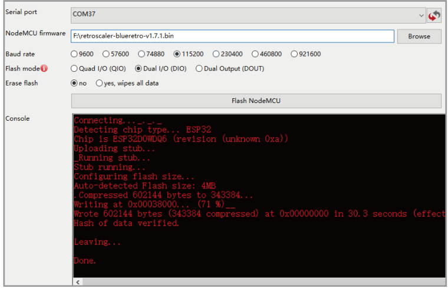

# Blueretro-PS
This firmware is merged from Blueretro source firmware ([darthcloud](https://github.com/darthcloud/BlueRetro/releases))
1. Download the [NodeMCU-PyFlasher](https://github.com/marcelstoer/nodemcu-pyflasher/releases) and Blueretro firmware.

2) Execute NodeMCU-PyFlasher.exe  

3) Connect Blueretro to computer using micro usb cable. Select proper COM port for your computer. And choose the latest BlueRetro firmware.  

4) Click Flash NodeMCU. Then wait for the burning to complete  

